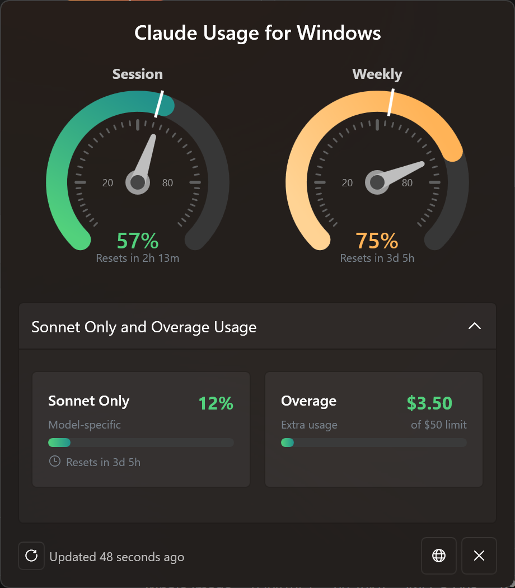

# Claude Usage Monitor for Windows

> [!NOTE]
> This repo is a **GitHub fork** of [sr-kai/claudeusagewin](https://github.com/sr-kai/claudeusagewin) (use **Fork** on that repo so your copy shows “forked from …” on GitHub). This fork keeps the lightweight tray design and adds an optional **HUD overlay** (small always-on-top session/weekly percentages). The app targets **.NET 9** on Windows (`net9.0-windows`).

Monitor Claude Code usage from your Windows system tray (and optionally a tiny on-screen overlay).

Lightweight, no installation, no Electron, no Python.

Works with **Claude Code native for Windows** or **Claude Code in WSL**.



## Features

- **Native & lightweight** — run a single `ClaudeUsage.exe`; no installer required
- **Zero configuration** — uses your existing Claude Code login (OAuth). No API key to paste
- **Up to 4 tray icons** — Session (5h), Weekly (7d), Sonnet Only, and Overage, each with a live percentage and color-coded status
- **Optional HUD overlay** — small borderless window above the taskbar (session + weekly %). Toggle from the tray menu; drag to move; position saved under `%LocalAppData%\ClaudeUsage\hud.json`
- **Color-coded status** — green (under pace), yellow (normal), red (high usage or >95%), gray (error/no data)
- **Smart credential discovery** — finds credentials from Claude Code on Windows or WSL (Debian, Ubuntu, etc.), preferring the most recently used file
- **WSL availability guard** — WSL paths time out if WSL is not running
- **14 languages** — auto-detected with override in the context menu
- **Adaptive polling** — wake intervals adjust for idle, errors, and upcoming quota resets
- **Token auto-refresh** — refreshes OAuth tokens before expiry
- **Launch at Login** — optional startup entry from the tray menu
- **Show Details** — show or hide Sonnet Only and Overage tray icons

## Requirements

- Windows 10 or Windows 11 (64-bit)
- [.NET 9 SDK](https://dotnet.microsoft.com/download/dotnet/9.0) (only if you build from source)
- Claude Code installed and logged in. The app reads `~/.claude/.credentials.json` (Windows or WSL).

## Quick start (download)

1. Open **[Releases](https://github.com/kaydensigh/claudeusagewin/releases)** on this fork (or your own fork’s Releases if you published there).
2. Download **`ClaudeUsage.exe`** from the latest release assets.
3. Put it anywhere you like and double-click to run (Windows may show SmartScreen — “More info” → Run anyway if you trust the build).

No build tools required for end users.

## How to use

| Action | What happens |
|--------|----------------|
| **Hover** a tray icon | Tooltip: usage % and time until reset |
| **Right-click** a tray icon | **Refresh Now**, **Toggle HUD overlay**, **Show Details**, **Launch at Login**, **Language**, **Exit** |

### HUD overlay (optional)

- **Tray → Toggle HUD overlay** — show or hide the small overlay.
- **Left-click** the overlay — toggle visibility (click vs. drag to move).
- **Right-click** the overlay — hide until you turn it on again from the tray.

The overlay may **briefly flicker** when you change tray settings or the shell refreshes (e.g. taskbar menus). That is a known limitation of keeping a small topmost window stable next to the taskbar.

### Tray icon not visible?

1. **Taskbar** → **Taskbar settings**
2. **Other system tray icons** (Windows 11) or **Select which icons appear on the taskbar** (Windows 10)
3. Turn **Claude Usage** / **ClaudeUsage** on.

## How it works

Credentials are resolved in order:

1. `%USERPROFILE%\.claude\.credentials.json` (Windows native)
2. `\\wsl$\{distro}\home\{user}\.claude\.credentials.json` for common distros

If both exist, the newer file wins. The app calls Anthropic’s usage API with your OAuth token.

> **Note:** This relies on usage endpoints that may change without notice.

---

## For developers: clone & build from GitHub

```bash
git clone https://github.com/kaydensigh/claudeusagewin.git
cd claudeusagewin
```

Or use your own fork URL after you fork on GitHub.

### Build (CLI)

```bash
cd ClaudeUsage
dotnet build -c Release
```

Output: `ClaudeUsage\bin\Release\net9.0-windows\win-x64\ClaudeUsage.exe` (and dependencies next to it).

### Publish a single folder (for sharing or testing)

```bash
cd ClaudeUsage
dotnet publish -c Release -r win-x64
```

Output: `ClaudeUsage\bin\Release\net9.0-windows\win-x64\publish\` — copy the whole folder or zip it; `ClaudeUsage.exe` is the entry point.

### Visual Studio

1. Open `ClaudeUsage.sln` in the repo root (or `ClaudeUsage/ClaudeUsage.csproj`).
2. Select **Release** and build.

If the app is already running from the same output folder, the project tries to close `ClaudeUsage.exe` before build so the EXE is not locked. You can disable that with `-p:KillRunningClaudeUsageBeforeBuild=false` if needed.

---

## Upload your fork to GitHub

If you started from a local copy and need a remote:

```bash
git remote add origin https://github.com/YOUR_USERNAME/YOUR_REPO.git
git branch -M main
git push -u origin main
```

To publish **releases** for others to download:

1. Push your `main` (or default) branch to GitHub.
2. In the repo: **Actions** → **Release** workflow → **Run workflow** (manual dispatch).  
   This bumps the version in `ClaudeUsage.csproj`, publishes `ClaudeUsage.exe`, and creates a GitHub Release with that binary.

You can also create a release manually: **Releases** → **Draft a new release**, attach `ClaudeUsage.exe` from your `dotnet publish` output.

---

## Tech stack

- **C# / .NET 9** (`net9.0-windows`), **WPF** for the optional HUD window
- **H.NotifyIcon** — tray icons
- **System.Drawing** — tray icon bitmaps
- **System.Text.Json** (source-generated contexts) for API and HUD settings JSON

---

## License

MIT
